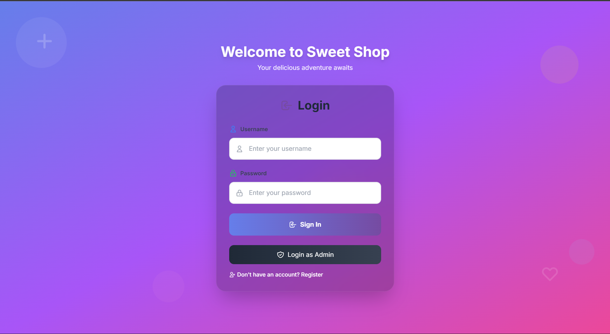
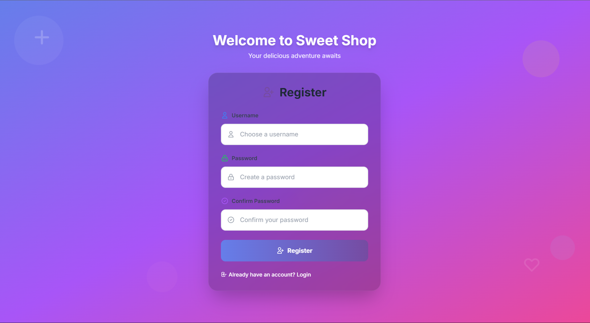
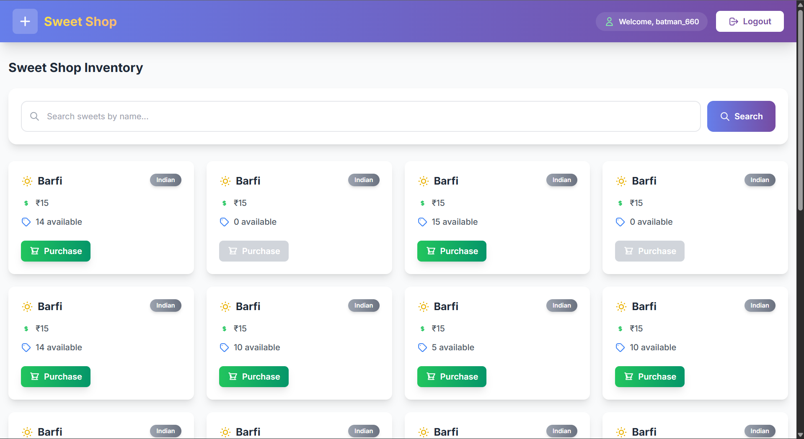
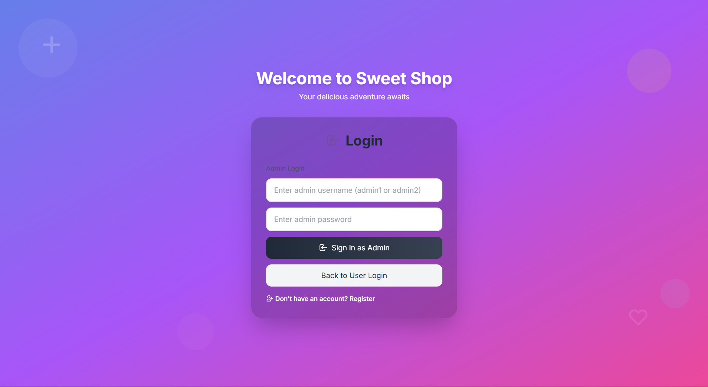
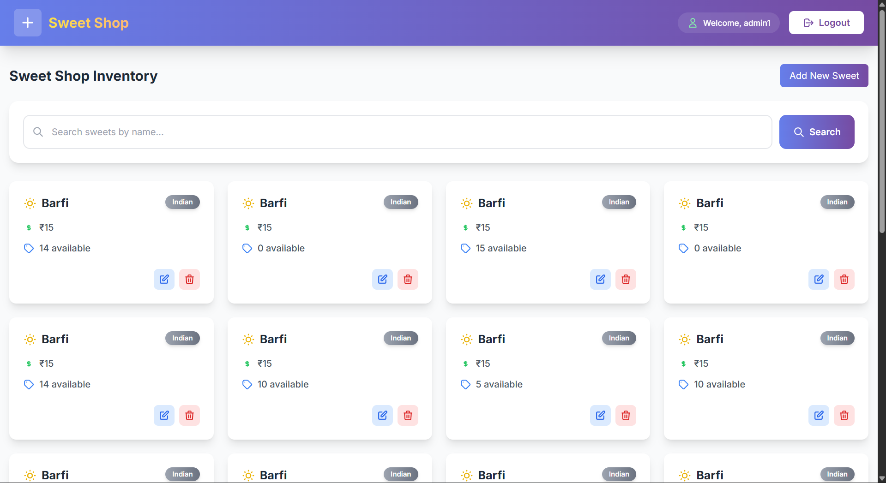

# Sweet Shop - Full Stack Application

This repository contains a React frontend and a FastAPI backend with MongoDB, created as part of an online assessment for Incubyte.

## Developer Information
- **Name:** Suraj Kumar Yadav
- **Semester:** 5, MCA
- **Roll No:** 23223090
- **Email:** yadavsurajkumar665@gmail.com
- **Assessment:** Incubyte Online Assessment

## Project Structure
- `frontend/` – React application (Create React App)
- `backend/` – FastAPI application with auth, sweets, and inventory routes

## Prerequisites
- Node.js 18+ and npm
- Python 3.12+
- MongoDB running locally or a cloud MongoDB URI

## Quick Start

### 1) Backend
In a new terminal:
```powershell
cd backend
python -m venv venv
.\venv\Scripts\Activate
pip install -r requirements.txt
```

Configure environment (copy `.env.example` to `.env` and set values such as `MONGODB_URI`, `JWT_SECRET_KEY`, etc.).

Start the API:
```powershell
uvicorn app.main:app --reload
```
The backend runs at `http://localhost:8000` and interactive API docs are at `http://localhost:8000/docs`.

### 2) Frontend
In another terminal:
```powershell
cd frontend
npm install
npm start
```
The frontend runs at `http://localhost:3000`.

If your backend URL differs, create `frontend/.env` with:
```env
REACT_APP_API_URL=http://localhost:8000
```

## Environment Configuration
- Backend: `backend/.env` (based on `backend/.env.example`)
- Frontend: `frontend/.env` (optional) to override API base URL

## Scripts

### Backend
- Start dev server: `uvicorn app.main:app --reload`
- Run tests: `pytest tests/`

### Frontend
- Start dev server: `npm start`
- Run tests (watch): `npm test`
- Build: `npm run build`

## Testing
- Backend tests use `pytest` under `backend/tests/`:
  ```powershell
  cd backend
  .\venv\Scripts\Activate
  pytest tests/
  ```
- Frontend tests use CRA (Jest + RTL):
  ```powershell
  cd frontend
  npm test
  ```

## Notes
- Ensure MongoDB is reachable at the URI configured in `backend/.env`.
- The frontend attaches JWT from `localStorage` to API requests.
- API documentation is available at `http://localhost:8000/docs` when the backend is running.

## Folder Highlights
- `backend/app/routers/` – route modules: `auth.py`, `sweets.py`, `inventory.py`
- `backend/app/auth/` – auth utilities and dependencies
- `backend/app/schemas/` – Pydantic models for request/response validation
- `frontend/src/pages/` – `Dashboard`, `auth` page
- `frontend/src/components/` – UI components such as `LoginForm`, `SweetCard`, `SweetModal`

## Assessment Details
This project demonstrates full-stack development skills including:
- React.js frontend with modern hooks and context API
- FastAPI backend with RESTful endpoints
- MongoDB database integration
- JWT-based authentication
- Responsive UI design
- API documentation with Swagger/OpenAPI

## Screenshots

### Frontend UI Modernization

The frontend has been modernized with contemporary design elements including:

#### 1. Login Page

*Glassmorphism login page with animated background, input icons, and modern form styling*

#### 2. Register Page

*Modern register page with form animations, visual feedback, and enhanced user experience*

#### 3. User Dashboard

*Modernized dashboard with enhanced SweetCard components featuring gradients, hover effects, and icons*

#### 4. Admin Login

*Admin login interface with secure authentication and modern design elements*

#### 5. Admin Dashboard

*Administrative dashboard with comprehensive management tools and modern UI*

---
*Submitted for Incubyte Online Assessment*
